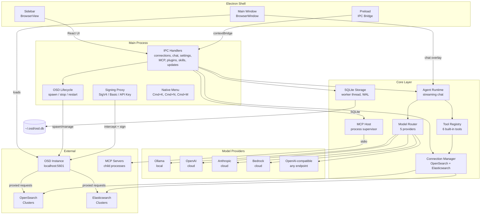
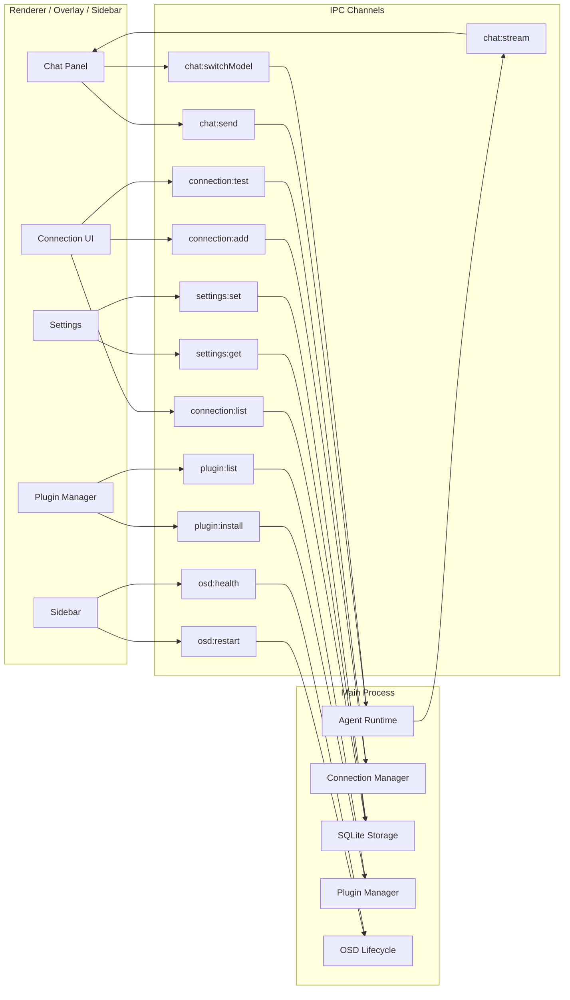
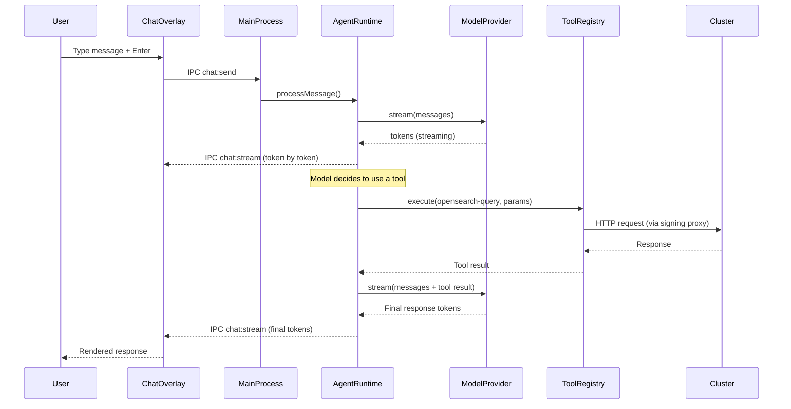

# Architecture Diagram

## System Overview

```mermaid
graph TB
    subgraph Electron["Electron Shell"]
        MW[Main Window<br/>BrowserWindow]
        SB[Sidebar<br/>BrowserView]
        PL[Preload<br/>IPC Bridge]
    end

    subgraph Main["Main Process"]
        OSD_LC[OSD Lifecycle<br/>spawn / stop / restart]
        SP[Signing Proxy<br/>SigV4 / Basic / API Key]
        IPC[IPC Handlers<br/>connections, chat, settings,<br/>MCP, plugins, skills, updates]
        MENU[Native Menu<br/>Cmd+K, Cmd+N, Cmd+M]
    end

    subgraph Core["Core Layer"]
        AR[Agent Runtime<br/>streaming chat]
        MR[Model Router<br/>5 providers]
        TR[Tool Registry<br/>6 built-in tools]
        MCP_H[MCP Host<br/>process supervisor]
        STORE[SQLite Storage<br/>worker thread, WAL]
        CONN[Connection Manager<br/>OpenSearch + Elasticsearch]
    end

    subgraph Providers["Model Providers"]
        OL[Ollama<br/>local]
        OAI[OpenAI<br/>cloud]
        ANT[Anthropic<br/>cloud]
        BED[Bedrock<br/>cloud]
        COMPAT[OpenAI-compatible<br/>any endpoint]
    end

    subgraph External["External"]
        OSD_INST[OSD Instance<br/>localhost:5601]
        OS_CLUSTER[OpenSearch<br/>Clusters]
        ES_CLUSTER[Elasticsearch<br/>Clusters]
        MCP_SRV[MCP Servers<br/>child processes]
    end

    MW -->|loads| OSD_INST
    SB -->|React UI| IPC
    PL -->|contextBridge| IPC
    MW -->|chat overlay| AR

    IPC --> OSD_LC
    IPC --> STORE
    IPC --> CONN
    IPC --> AR
    IPC --> MCP_H

    OSD_LC -->|spawn/manage| OSD_INST
    SP -->|intercept + sign| OSD_INST
    OSD_INST -->|proxied requests| OS_CLUSTER
    OSD_INST -->|proxied requests| ES_CLUSTER

    AR --> MR
    AR --> TR
    MR --> OL
    MR --> OAI
    MR --> ANT
    MR --> BED
    MR --> COMPAT

    TR --> CONN
    MCP_H -->|stdio| MCP_SRV

    CONN --> OS_CLUSTER
    CONN --> ES_CLUSTER

    STORE -->|SQLite| DB[(~/.osd/osd.db)]
```

## IPC Channel Map

```mermaid
graph LR
    subgraph Renderer["Renderer / Overlay / Sidebar"]
        R_CHAT[Chat Panel]
        R_CONN[Connection UI]
        R_SET[Settings]
        R_PLUG[Plugin Manager]
        R_SIDE[Sidebar]
    end

    subgraph IPC["IPC Channels"]
        CH_SEND[chat:send]
        CH_STREAM[chat:stream]
        CH_MODEL[chat:switchModel]
        CONN_ADD[connection:add]
        CONN_TEST[connection:test]
        CONN_LIST[connection:list]
        SET_GET[settings:get]
        SET_SET[settings:set]
        PLUG_INST[plugin:install]
        PLUG_LIST[plugin:list]
        OSD_BOUNCE[osd:restart]
        OSD_HEALTH[osd:health]
    end

    subgraph Main["Main Process"]
        M_AGENT[Agent Runtime]
        M_CONN[Connection Manager]
        M_STORE[SQLite Storage]
        M_PLUG[Plugin Manager]
        M_OSD[OSD Lifecycle]
    end

    R_CHAT --> CH_SEND --> M_AGENT
    M_AGENT --> CH_STREAM --> R_CHAT
    R_CHAT --> CH_MODEL --> M_AGENT
    R_CONN --> CONN_ADD --> M_CONN
    R_CONN --> CONN_TEST --> M_CONN
    R_CONN --> CONN_LIST --> M_STORE
    R_SET --> SET_GET --> M_STORE
    R_SET --> SET_SET --> M_STORE
    R_PLUG --> PLUG_INST --> M_PLUG
    R_PLUG --> PLUG_LIST --> M_PLUG
    R_SIDE --> OSD_BOUNCE --> M_OSD
    R_SIDE --> OSD_HEALTH --> M_OSD
```

## Data Flow

```mermaid
sequenceDiagram
    participant User
    participant ChatOverlay
    participant MainProcess
    participant AgentRuntime
    participant ModelProvider
    participant ToolRegistry
    participant Cluster

    User->>ChatOverlay: Type message + Enter
    ChatOverlay->>MainProcess: IPC chat:send
    MainProcess->>AgentRuntime: processMessage()
    AgentRuntime->>ModelProvider: stream(messages)
    ModelProvider-->>AgentRuntime: tokens (streaming)
    AgentRuntime-->>ChatOverlay: IPC chat:stream (token by token)

    Note over AgentRuntime: Model decides to use a tool
    AgentRuntime->>ToolRegistry: execute(opensearch-query, params)
    ToolRegistry->>Cluster: HTTP request (via signing proxy)
    Cluster-->>ToolRegistry: Response
    ToolRegistry-->>AgentRuntime: Tool result
    AgentRuntime->>ModelProvider: stream(messages + tool result)
    ModelProvider-->>AgentRuntime: Final response tokens
    AgentRuntime-->>ChatOverlay: IPC chat:stream (final tokens)
    ChatOverlay-->>User: Rendered response
```
